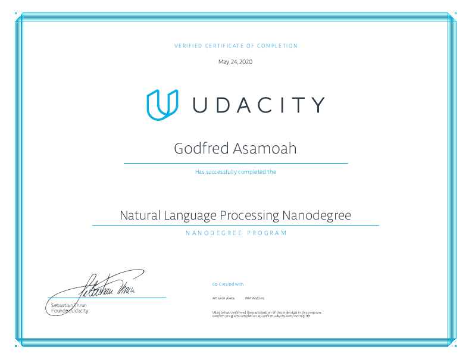

# Natural Language Processing Nanodegree Projects

This repository contains my projects for Udacity's [Natural Language Processing Nanodegree Program](https://www.udacity.com/course/natural-language-processing-nanodegree--nd892).

## Projects

- [1 - Part of Speech Tagging](/1-pos-tagging): Use several techniques, including table lookups, n-grams, and hidden Markov models, to tag parts of speech in sentences, and compare their performance.

- [2 - Machine Translation](/2-machine-translation): Build a deep neural network that functions as part of an end-to-end machine translation pipeline. The completed pipeline will accept English text as input and return the French translation.

- [3 - DNN Speech Recognizer](/3-speech-recognizer): Build a deep neural network that functions as part of an end-to-end automatic speech recognition (ASR) pipeline. The model will convert raw audio into feature representations, which will then turn them into transcribed text.

## Graduation Certificate🎉🎉

[Certificate Link](https://confirm.udacity.com/LVF7QC99)
